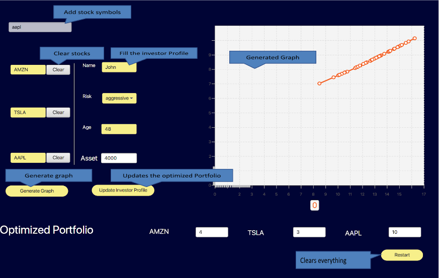

# Investment Portfolio Assistant (IPA) User Guide

## Table of Contents:

1. [Introduction](#description-of-the-project)
   1. [Purpose of Investment Portfolio Assistant (IPA)](#project-description-investment-portfolio-assistant)

2. [Key Features](#key-features)
   1. [Simplified Data Extraction](#simplified-data-extraction)
   2. [User-Friendly Interface](#user-friendly-interface)
   3. [Personalized Investment Suggestions](#personalize-investment-suggestion)
   4. [Portfolio Generation](#portfolio-generation)

3. [How to Use Investment Portfolio Assistant (IPA)](#how-to-use-investment-portfolio-assistant-ipa)
   1. [Stock Selection](#stock-selection)
   2. [Input Preferences](#input-preferences)
   3. [Generate Portfolio](#generate-portfolio)
   4. [Visualize Options](#visualize-options)

4. [Troubleshooting](#troubleshooting)
   1. [Technical Issues](#technical-issues)
   2. [Data Accuracy](#data-accuracy)
   3. [Support and Feedback](#support-and-feedback)

5. [References](#references)

---

### Description of the project

#### Project Description: Investment Portfolio Assistant (IPA)
The Investment Portfolio Assistant (IPA) is a user-friendly application designed for beginner investors who may find the financial market intimidating. The goal of IPA is to simplify the investment process, provide relevant financial market information, and offer personalized investment suggestions based on user preferences.

### Key Features:
#### 2.1 Simplified Data Extraction
IPA extracts relevant financial market data from reputable sources, eliminating the need for users to navigate through complex financial websites.

#### 2.2 User-Friendly Interface
The application is designed with a user-friendly interface to cater to individuals with varying levels of financial literacy. It aims to bridge the gap for the 15% of Canadians who consider themselves financially illiterate.

#### 2.3 Personalized Investment Suggestions
Users can select stocks of interest and input their asset and risk tolerance. IPA generates personalized investment suggestions, taking into account the user's preferences and financial goals.

#### 2.4 Portfolio Generation
The application includes a feature where users can generate the best-fit portfolio based on their equity and risk tolerance. The generated portfolio options are visually presented, allowing users to see individual risk and return metrics for each option.

### How to use:

#### How to Use Investment Portfolio Assistant (IPA)

#### 1. **Stock Selection:** 
Choose the stocks you are interested in by searching or selecting from a predefined list.
#### 2. **Input Preferences:** 
Specify your asset and risk tolerance preferences. This information is crucial for IPA to tailor investment suggestions to your needs.
#### 3. **Generate Portfolio:** 
Click on the "Generate Portfolio" button to receive personalized investment portfolio options based on your preferences.
#### 4. **Visualize Options:** 
View a graph that illustrates individual risk and return metrics for each portfolio option. This visualization helps you make informed decisions about diversification.

### Troubleshooting 

#### 1. **Technical Issues:** 
If you encounter technical difficulties, ensure that you have a stable internet connection. Refresh the page or restart the application.
#### 2. **Data Accuracy:** 
Double-check the accuracy of the input information, such as stock selections and preferences, to ensure the generated portfolio aligns with your expectations.
#### 3. **Support and Feedback:** 
For further assistance, reach out to our support team through the provided contact channels. We also welcome feedback to improve the user experience.

### References 
#### 1. [Capital Asset Pricing Model (CAPM)](https://www.investopedia.com/terms/c/capm.asp)
#### 2. [Efficient Frontier](https://www.investopedia.com/terms/e/efficientfrontier.asp)
#### 3. [Understanding Risk Tolerance](https://www.investopedia.com/articles/pf/07/risk_tolerance.asp)